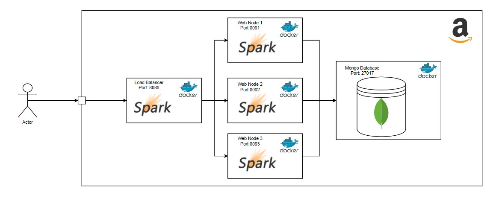
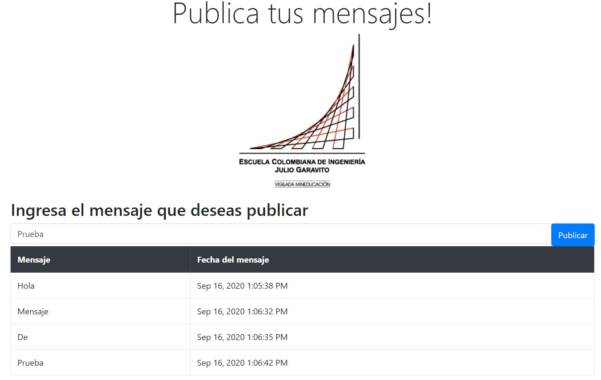
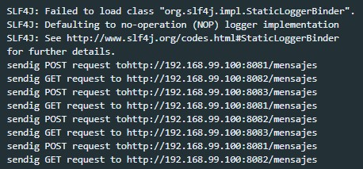
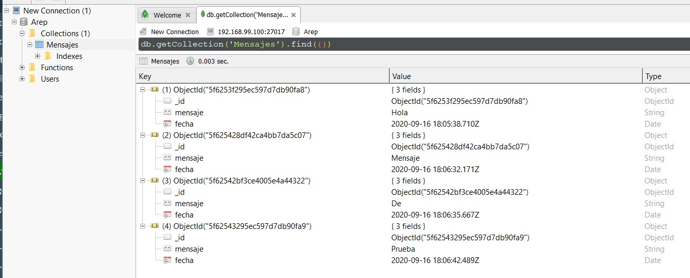
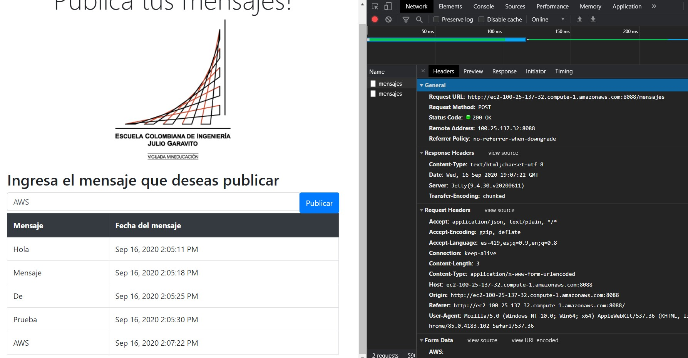
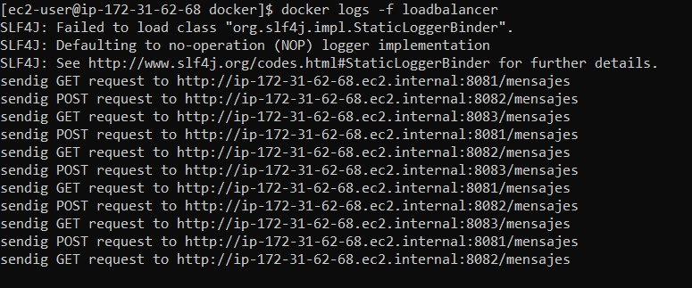

# AREP-DockerLab

En este laboratorio se implementó un sistema con la arquitectura mostrada en la siguiente imagen, este sistema esta compuesto
por un balanceador de carga, 3 nodos de aplicación y una base de datos Mongo, cada uno de estos se encuentra en un contenedor
construido con Docker. La aplicación implementada permite almacenar y consultar mensajes en una base de datos.



Para la construcción de los contenedores se utilizó Docker ToolBox por lo que la aplicación local funciona sobre la dirección
http://192.168.99.100:8088  y esto podría variar si no se utiliza la misma herramienta.

Para probar la aplicación se publicaron algunos mensajes y se revisaron los logs del balanceador de carga asi como la presencia de los
mensajes en la base de datos. En AWS se realizó en mismo ejercicio pero sin revisar el contenido de la base de datos.

 Los detalles de la arquitectura se especifican en el documento de diseño[Arquitectura.pdf](Arquitectura.pdf)


## Pre-requisitos
* [Docker](https://www.docker.com/) - Administrador de contenedores
* [Maven](https://maven.apache.org/) - Administrador de dependencias
* [Git](https://git-scm.com/) - Sistema de control de versiones
* [Java](https://www.java.com/) - Tecnología para el desarrollo de aplicaciones

## Instrucciones de uso 

Para descargar el proyecto se debe usar 
```
git clone https://github.com/Jcro15/DockerLab.git
```

Una vez descargado el proyecto deben compilarse los proyectos de App y de LoadBalancer usando el siguiente comando
 desde cada directorio

```
mvn package 
```

Para ejecutar la aplicación se debe usar el comando desde el directorio raiz usando Docker ToolBox

```
docker-compose up -d --scale web=3
```

Al usar este comando con Docker ToolBox la aplicación se puede usar desde http://192.168.99.100:8088


## Pruebas

### Local
Publicando mensajes sobre el balancedor de carga local

 

Revisando los logs del balanceador de carga y evidencia de round robin entre los 
nodos de aplicación
  

Contenido de la base de datos luego de estas operaciones


### AWS

Publicando mensajes sobre el balanceador de carga en AWS


Logs del balanceador de carga en aws redirigiendo peticiones a los nodos de lógica



## Construido con

* [Maven](https://maven.apache.org/) - Administrador de dependencias
* [Docker](https://www.docker.com/) - Administrador de contenedores


## Autor

* **Juan Camilo Rojas Ortiz** - *Estudiante de ingeniería de sistemas* 

## Licencia

Este proyecto esta bajo la licencia GNU(General Public License) los detalles se pueden encontrar en el archivo [LICENSE](LICENSE)

